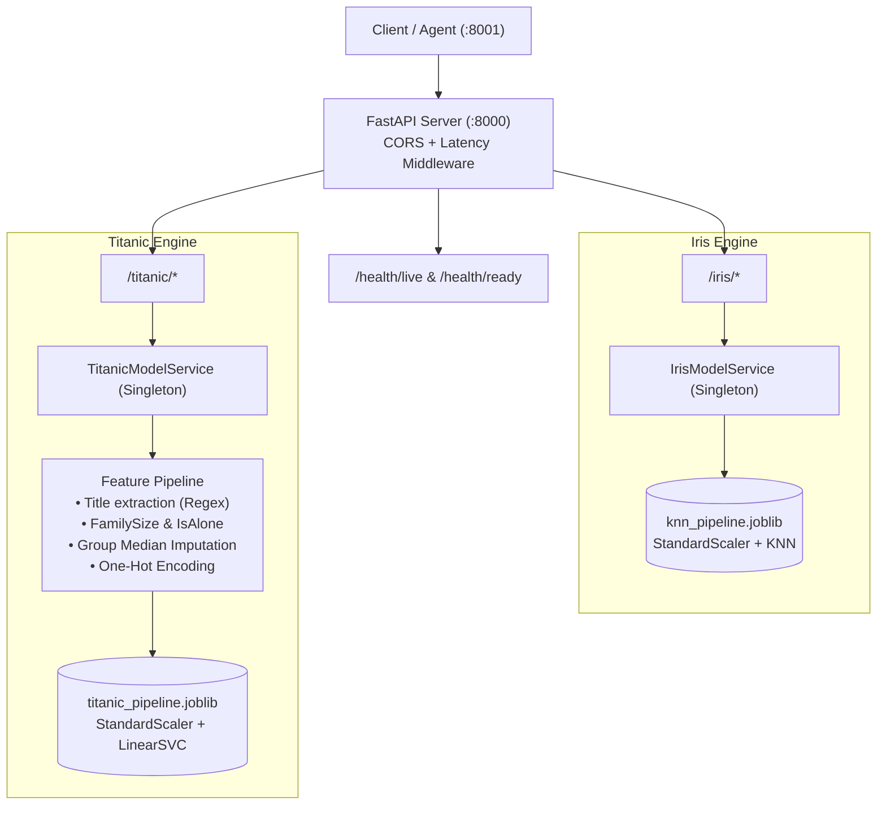
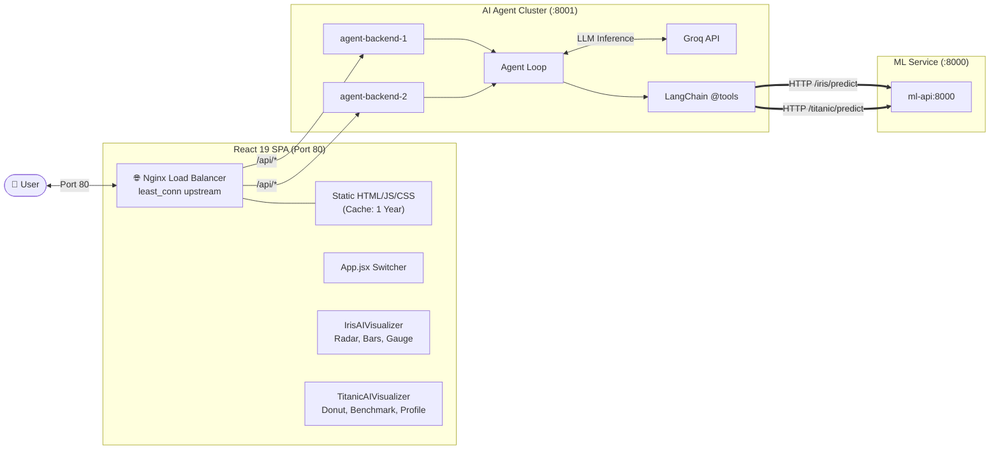
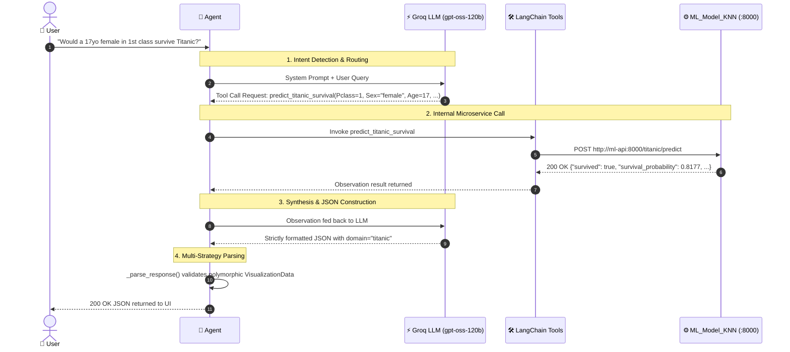

# AI & ML Documentation

Comprehensive architecture, API reference, operational guides, and workflow documentation for both microservices in the platform:
1. **`ML_Model_KNN`** — High-Performance Multi-Model ML Inference Microservice (`:8000`)
2. **`Call_ML_Model`** — Autonomous AI Agent Platform & Real-Time React Visualizer (`:80` / `:8001`)

---

# PART 1: `ML_Model_KNN` — Machine Learning Inference Microservice

## 1. Overview & Architecture

`ML_Model_KNN` is an isolated, production-grade ML inference microservice built with **FastAPI**, **uv**, and **Scikit-Learn**, running behind **Gunicorn** with multiple async **Uvicorn** worker processes.

The service serves two distinct machine learning models on a unified FastAPI host (`http://localhost:8000`):
1. **Iris Flower Classifier**: Distance-weighted K-Nearest Neighbors (KNN, $k=7$)
2. **Titanic Survival Predictor**: Linear Support Vector Classification (LinearSVC, $C=0.1$)



---

## 2. Directory Structure

```text
ML_Model_KNN/
├── app/
│   ├── __init__.py
│   ├── config.py                     # Environment variables & model path settings
│   ├── main.py                       # Root FastAPI application, lifespan & routers
│   ├── routers/
│   │   ├── __init__.py
│   │   ├── iris_router.py            # Endpoints: /iris/predict, /iris/predict/batch, /iris/metadata
│   │   └── titanic_router.py         # Endpoints: /titanic/predict, /titanic/metadata
│   ├── services/
│   │   ├── __init__.py
│   │   ├── iris_service.py           # Iris inference engine (loads knn_pipeline.joblib)
│   │   └── titanic_service.py        # Titanic inference engine (loads titanic_pipeline.joblib)
│   └── schemas/
│       ├── __init__.py
│       ├── iris_schemas.py           # Pydantic models for Iris requests & responses
│       ├── titanic_schemas.py        # Pydantic models for Titanic requests & responses
│       └── health_schemas.py         # Multi-model health check schemas
├── models/
│   ├── knn_pipeline.joblib           # Serialized Iris KNN model artifact
│   ├── titanic_pipeline.joblib       # Serialized Titanic LinearSVC model artifact
│   ├── model_metadata.json           # Version, accuracy (100%), and Iris feature metadata
│   └── titanic_metadata.json         # Version, accuracy (84.92%), imputation medians & columns
├── Dockerfile                        # Multi-stage container (Python 3.13-slim + uv + non-root user)
├── docker-compose.yml                # Standalone test orchestration file
├── pyproject.toml                    # Dependencies (FastAPI, Scikit-Learn, Joblib, etc.)
├── uv.lock                           # Locked reproducible dependencies
├── train_pipeline.py                 # Iris training script
└── train_titanic.py                  # Titanic training script
```

---

## 3. ML Models & Engineering Details 

### A. Iris Species Classification
* **Algorithm**: $K$-Nearest Neighbors Classifier ($k=7$, Manhattan distance metric, distance-weighted).
* **Pipeline**: `StandardScaler` $\rightarrow$ `KNeighborsClassifier(n_neighbors=7, metric='manhattan', weights='distance')`.
* **Accuracy**: **100%** on 20% holdout test set.
* **Input Features**: `sepal_length`, `sepal_width`, `petal_length`, `petal_width` (all in cm, bounded $0.0 < x < 15.0$).

### B. Titanic Survival Prediction
* **Algorithm**: Linear Support Vector Classification (`LinearSVC`, $C=0.1$, `dual=False`, `max_iter=10000`).
* **Pipeline**: Custom Feature Preprocessing $\rightarrow$ `StandardScaler` $\rightarrow$ `LinearSVC`.
* **Accuracy**: **84.92%** on stratified 20% test set (179 passengers).
* **Probability Calibration**: Because `LinearSVC` calculates hyperplane distances (`decision_function`) without native probabilities, probabilities are calibrated via numerically stable Sigmoid mapping:
  $$P(\text{Survival}) = \frac{1}{1 + e^{-f(x)}}$$

#### Feature Engineering Pipeline:
1. **Title Extraction**: Regex parsing of `Name` (`r" ([A-Za-z]+)\."`). Rare titles (`Lady`, `Countess`, `Capt`, `Col`, `Don`, `Dr`, `Major`, `Rev`, `Sir`, `Jonkheer`, `Dona`) grouped to `Rare`. `Mlle`/`Ms` normalized to `Miss`, `Mme` to `Mrs`.
2. **Family Metrics**: $\text{FamilySize} = \text{SibSp} + \text{Parch} + 1$, and $\text{IsAlone} = (\text{FamilySize} == 1)$.
3. **Cabin Possession**: $\text{HasCabin} = \text{Cabin is not null}$.
4. **Group-Median Imputation**:
   - `Age`: Imputed using precomputed Title $\times$ Pclass median matrix from `titanic_metadata.json` (e.g., `Miss_1`, `Mr_3`).
   - `Fare`: Imputed using dataset median (£14.45).
   - `Embarked`: Missing values imputed to Southampton (`S`).
5. **Categorical Alignment**: One-hot encoding of `Sex`, `Embarked`, and `Title` strictly aligned to the 18 training columns.

---

## 4. API Reference (`ML_Model_KNN`)

### Health Endpoints
* **`GET /health/live`**: Fast liveness probe returning `{"status": "alive"}`.
* **`GET /health/ready`**: Readiness probe checking whether both model artifacts are loaded in memory.
  ```json
  {
    "status": "ready",
    "models": {
      "iris": {"loaded": true, "version": "1.4.0", "model_type": "KNeighborsClassifier"},
      "titanic": {"loaded": true, "version": "1.0.3", "model_type": "LinearSVC"}
    }
  }
  ```

### Iris Endpoints
* **`POST /iris/predict`**: Predict species for a single flower.
  * **Payload**:
    ```json
    {
      "sepal_length": 5.1,
      "sepal_width": 3.5,
      "petal_length": 1.4,
      "petal_width": 0.2
    }
    ```
  * **Response (200 OK)**:
    ```json
    {
      "predicted_species": "setosa",
      "confidence": 1.0,
      "probabilities": {
        "setosa": 1.0,
        "versicolor": 0.0,
        "virginica": 0.0
      },
      "input_features": {
        "sepal_length": 5.1,
        "sepal_width": 3.5,
        "petal_length": 1.4,
        "petal_width": 0.2
      }
    }
    ```
* **`GET /iris/metadata`**: Returns model parameters, training timestamp, and feature list.

### Titanic Endpoints
* **`POST /titanic/predict`**: Predict passenger survival likelihood.
  * **Payload**:
    ```json
    {
      "Pclass": 1,
      "Name": "DeWitt Bukater, Miss. Rose",
      "Sex": "female",
      "Age": 17.0,
      "SibSp": 0,
      "Parch": 1,
      "Fare": 512.0,
      "Cabin": "B20",
      "Embarked": "S"
    }
    ```
  * **Response (200 OK)**:
    ```json
    {
      "survived": true,
      "survival_probability": 0.8177,
      "confidence": 0.8177,
      "risk_factors": {
        "passenger_class": "positive — 1st class passengers had priority access to lifeboats",
        "gender": "positive — women had significantly higher survival rates",
        "family": "positive — traveling with small family increased survival chance",
        "fare": "positive — high fare correlated with higher deck accommodations"
      },
      "passenger_profile": {
        "title": "Miss",
        "class": 1,
        "age": 17.0,
        "sex": "female",
        "family_size": 2,
        "is_alone": false,
        "has_cabin": true,
        "embarked": "S",
        "fare": 512.0
      },
      "input_features": { ... }
    }
    ```
* **`GET /titanic/metadata`**: Returns accuracy, 18-feature column list, and age imputation lookup dictionaries.

---

## 5. Local Setup (`ML_Model_KNN`)

```bash
# 1. Navigate to service directory
cd ML_Model_KNN

# 2. Sync virtual environment using uv
uv sync

# 3. Train both models (generates .joblib and .json artifacts)
uv run python train_pipeline.py
uv run python train_titanic.py

# 5. Run API development server
uv run uvicorn app.main:app --host 0.0.0.0 --port 8000 --reload
```

---
---

# PART 2: `Call_ML_Model` — AI Agent: ReAct

## 1. Overview & Architecture

`Call_ML_Model` is the intelligence and user experience platform. It integrates a **LangChain ReAct Agent** powered by Groq's high-speed inference engine (`openai/gpt-oss-120b`) with an interactive **React 19** analytics dashboard, all served behind an **Nginx Reverse Proxy & Load Balancer**.



---

## 2. Directory Structure

```text
Call_ML_Model/
├── docker-compose.yml                # Cluster orchestration: ml-api, 2 agent instances, Nginx
├── README.md                         # Project overview
├── .gitignore                        # Secrets, venvs, build artifacts, OS caches
│
├── backend/                          # 🤖 AI Agent Microservice (:8001)
│   ├── app/
│   │   ├── __init__.py
│   │   ├── config.py                 # Loads GROQ_API_KEY, KNN_SERVICE_URL, AGENT_MODEL
│   │   ├── main.py                   # FastAPI app, CORS, lifespan, HTTP middleware
│   │   ├── agents/
│   │   │   ├── __init__.py
│   │   │   ├── botanical_agent.py    # Autonomous tool-calling ReAct agent
│   │   │   └── prompts.py            # Multi-domain routing system prompt & JSON contracts
│   │   ├── tools/
│   │   │   ├── __init__.py
│   │   │   ├── botanical_tools.py    # @tool predict_iris_species, @tool predict_titanic_survival
│   │   │   └── knn_client.py         # Async HTTP client with backoff retry to :8000
│   │   ├── schemas/
│   │   │   ├── __init__.py
│   │   │   ├── request_schemas.py    # AnalyzeRequest model
│   │   │   ├── response_schemas.py   # Polymorphic VisualizationData (domain: "iris" | "titanic")
│   │   │   └── ml_contract.py        # Typed contracts matching ML_Model_KNN schemas
│   │   ├── core/
│   │   │   ├── __init__.py
│   │   │   ├── exceptions.py         # Exception handlers (KNNServiceUnavailable, etc.)
│   │   │   └── logging_config.py     # Request ID correlation & structured logging
│   │   └── api/v1/
│   │       ├── __init__.py
│   │       ├── chat.py               # POST /api/v1/analyze
│   │       └── health.py             # GET /health/live & GET /health/ready
│   ├── .env                          # Local credentials (GROQ_API_KEY)
│   ├── Dockerfile                    # Multi-stage Python 3.13-slim build with non-root user
│   ├── pyproject.toml                # Dependencies (FastAPI, LangChain, Groq, etc.)
│   └── uv.lock                       # Lockfile
│
└── frontend/                         # 🎨 React 19 + Tailwind CSS + Recharts UI (:80)
    ├── src/
    │   ├── main.jsx                  # React DOM mount point
    │   ├── App.jsx                   # Dynamic root layout switching on result.domain
    │   ├── components/
    │   │   ├── chat/
    │   │   │   └── ChatInput.jsx     # Input bar with Quick Preset buttons for Iris & Titanic
    │   │   ├── common/
    │   │   │   ├── Header.jsx        # Navigation bar with live cluster health dot
    │   │   │   ├── LoadingSpinner.jsx# Animated pulse loader
    │   │   │   ├── ErrorAlert.jsx    # Dismissible error banner
    │   │   │   └── index.js          # Barrel export
    │   │   └── visualizer/
    │   │       ├── iris/             # 🌸 Dedicated Iris Components
    │   │       │   ├── IrisAIVisualizer.jsx  # Main Iris 2x2 grid container
    │   │       │   ├── FeatureRadar.jsx      # 4-axis radial measurement radar chart
    │   │       │   ├── ProbabilityChart.jsx  # Horizontal probability distribution bars
    │   │       │   └── ConfidenceGauge.jsx   # Donut confidence meter
    │   │       ├── titanic/          # 🚢 Dedicated Titanic Components
    │   │       │   ├── TitanicAIVisualizer.jsx# Main Titanic 2x2 grid container
    │   │       │   ├── SurvivalGauge.jsx     # Semi-circle survival likelihood gauge
    │   │       │   ├── DemographicBenchmark.jsx# 1912 historical survival comparison bars
    │   │       │   └── PassengerProfileCard.jsx# Passenger traits & risk factor badges
    │   │       ├── common/
    │   │       │   └── AIExplanation.jsx     # LLM analytical breakdown & latency badge
    │   │       └── index.js          # Barrel export
    │   ├── hooks/
    │   │   └── useBotanicalAgent.js  # State hook managing query, loading, domain, results
    │   ├── services/
    │   │   ├── api.js                # Axios client with interceptors
    │   │   └── agentService.js       # Calls POST /api/v1/analyze & health endpoints
    │   └── styles/
    │       └── index.css             # Tailwind 4 imports and custom scrollbars
    ├── nginx.conf                    # Hardened Reverse Proxy, Rate Limiter & Load Balancer
    ├── Dockerfile                    # Multi-stage build (Node builder -> Nginx Alpine)
    ├── package.json                  # Dependencies (React 19, Recharts, Lucide)
    └── vite.config.js                # Dev proxy configuration to port 8001
```

---

## 3. How the AI Agent Works (ReAct Execution Loop)

The agent runs a 4-step autonomous reasoning cycle:



### Polymorphic Response Schema:
When the agent finishes reasoning, it returns a single unified schema with a `domain` discriminator:
```python
class VisualizationData(BaseModel):
    domain: str  # "iris" or "titanic"

    # Present when domain == "iris"
    prediction: Optional[PredictionDetail] = None
    probabilities: Optional[list[ProbabilityEntry]] = None
    feature_comparison: Optional[list[FeatureComparison]] = None

    # Present when domain == "titanic"
    survived: Optional[bool] = None
    survival_probability: Optional[float] = None
    confidence: Optional[float] = None
    risk_factors: Optional[dict[str, str]] = None
    passenger_profile: Optional[dict[str, Any]] = None

    # Shared across both domains
    analysis: str
    visualization_hints: dict[str, str] = Field(default_factory=dict)
```

---

## 4. Frontend Dynamic Rendering Logic

In [App.jsx](file:///c:/Users/subha/Downloads/AI_ML/Call_ML_Model/frontend/src/App.jsx), the UI dynamically swaps the active visualizer card without requiring page reloads:

```jsx
{result && !loading && domain === 'iris' && (
  <IrisAIVisualizer result={result} processingTime={processingTime} />
)}

{result && !loading && domain === 'titanic' && (
  <TitanicAIVisualizer result={result} processingTime={processingTime} />
)}
```

* **Iris Visualizer Grid**:
  1. `ConfidenceGauge`: Donut chart showing prediction certainty percentage.
  2. `ProbabilityChart`: Horizontal distribution across all 3 flower species.
  3. `FeatureRadar`: 4-axis polar radar contrasting user measurements against dataset averages.
  4. `AIExplanation`: Step-by-step LLM botanical reasoning.
* **Titanic Visualizer Grid**:
  1. `SurvivalGauge`: Half-circle meter (green for survived, red for perished) with survival probability.
  2. `PassengerProfileCard`: Extracted traits (Title, Class, Age, Fare, Cabin) and color-coded risk factors.
  3. `DemographicBenchmark`: Grouped bar chart comparing the passenger to 1912 historical averages by Class, Sex, and Age.
  4. `AIExplanation`: Historical contextual explanation from the LLM.

---

## 5. Nginx Reverse Proxy, Load Balancer & Rate Limiter

The frontend container runs an **Nginx Alpine** web server acting as the ingress controller on **Port 80**:

### A. Load Balancing (`least_conn`)
```nginx
upstream backend_cluster {
    least_conn;
    server agent-backend-1:8001 max_fails=3 fail_timeout=10s;
    server agent-backend-2:8001 max_fails=3 fail_timeout=10s;
    keepalive 32;
}
```
* **Algorithm**: Routes incoming requests to whichever backend container currently has the fewest active requests.
* **High Availability**: If an instance fails 3 times, Nginx automatically stops sending traffic to it for 10 seconds.
* **Socket Reuse**: Maintains up to 32 idle TCP connections in its keepalive pool.

### B. Rate Limiting (Abuse Protection)
```nginx
limit_req_zone $binary_remote_addr zone=api_limit:10m rate=10r/s;
limit_req_status 429;
...
location /api/ {
    limit_req zone=api_limit burst=20 nodelay;
    proxy_pass http://backend_cluster;
}
```
* Limits each unique client IP to **10 requests/second** with a burst buffer of 20.
* Abusive clients immediately receive **HTTP 429 Too Many Requests** at the Nginx edge without loading the Python backend.

---

## 6. How to Run the Entire Production Platform

### Via Docker Compose (Recommended)
```bash
# 1. Navigate to Call_ML_Model
cd Call_ML_Model

# 2. Verify backend/.env contains your GROQ_API_KEY
# (e.g. GROQ_API_KEY="gsk_...")

# 3. Build and launch all 4 microservices in background
docker compose up --build -d

# 4. Verify all container healthchecks pass
docker compose ps
```

### Access URLs:
* **Web UI Dashboard**: `http://localhost`
* **Health Check Probe**: `http://localhost/health/ready`
* **ML Model Swagger Docs**: `http://localhost:8000/docs`

### Graceful Shutdown:
```bash
docker compose down
```
